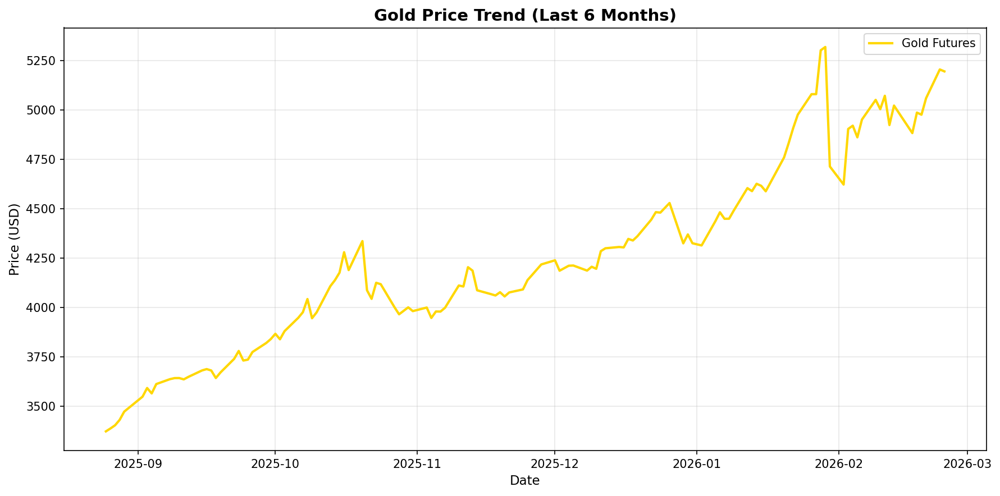
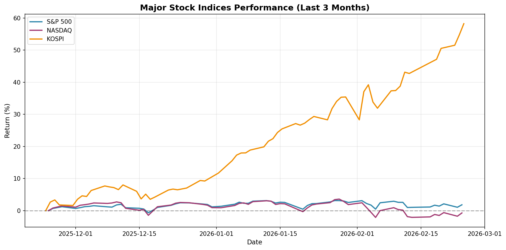
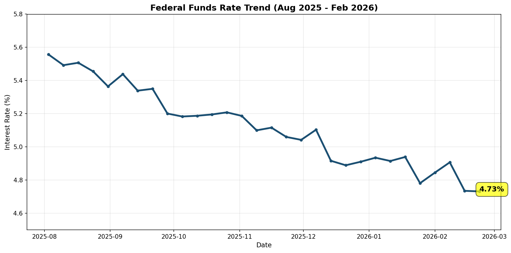
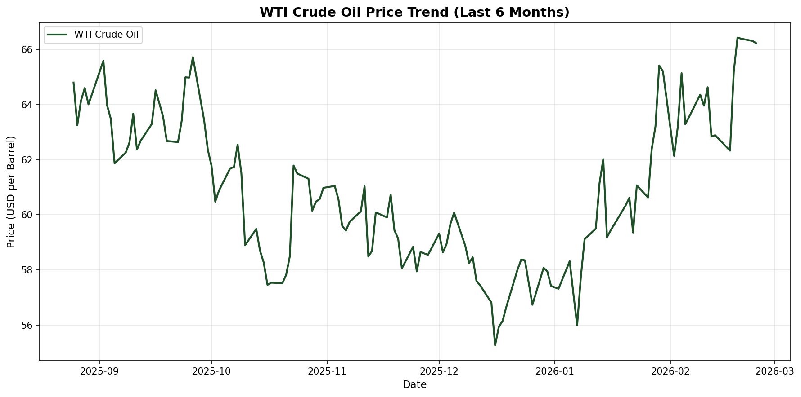

## 글로벌 경제 핵심 동향: 2026년 2월 25일

2026년 2월, 글로벌 경제는 중요한 전환점을 맞이하고 있습니다. 연준의 금리 인하 기대가 커지면서 금융 시장이 재편되고 있으며, 원자재 가격의 변동성이 지속되고 있습니다. 이번 분석에서는 최근 경제 데이터와 시장 트렌드를 종합적으로 살펴보겠습니다.

---

## 1. 금 가격 상승세와 안전 자산 선호

최근 6개월간 금 가격은 꾸준한 상승세를 보이고 있습니다. 금은 전통적인 안전 자산으로서 불확실성이 높은 시기에 투자자들의 선호를 받고 있습니다.

*그림 1. 금 선물 가격 추이 (최근 6개월) | 출처: Yahoo Finance*

### 금 가격 상승의 주요 요인

- **연준 금리 인하 기대**: 금리 인하가 금리 예수 금액의 수익률을 낮추면서 금 매수 심리를 자극
- **지정학적 리스크**: 글로벌 지정학적 긴장감이 지속되면서 안전 자산 선호 증가
- **달러 약세**: 달러 인덱스 하락이 금 가격 상승에 기여
- **중앙은행의 금 보유 증가**: 개발도상국 중앙은행들의 금 매입이 지속

### 투자자 포인트
금 가격의 상승세가 당분간 이어질 것으로 전망되지만, 단기적인 변동성에 대비한 포트폴리오 분산이 필요합니다.

---

## 2. 주요 주식 지수 비교: 미국 vs 아시아

최근 3개월간 주요 주식 지수의 성과를 비교하면 지역별로 뚜렷한 차이를 보입니다.

*그림 2. 주요 주식 지수 수익률 비교 (최근 3개월) | 출처: Yahoo Finance*

### 지역별 시장 특성

**미국 시장 (S&P 500, NASDAQ)**
- 기술 주 중심의 NASDAQ이 강세
- AI 및 반도체 관련 기업의 호조가 시장을 견인
- 연준 금리 인하 기대가 성장 주에 긍정적

**아시아 시장 (KOSPI)**
- 반도체 호조에도 불구하고 상대적 약세
- 환율 변동성과 수출 둔화 우려
- 중국 경제 둔화 영향

### 시장 전망
2026년 상반기에는 미국 시장의 상대적 강세가 지속될 가능성이 있으나, 아시아 시장의 저평가 기업에 대한 관심도 필요합니다.

---

## 3. 연준 금리 정책: 인하 기대와 시장 영향

연준의 금리 정책은 글로벌 금융 시장에 가장 큰 영향을 미치는 요인입니다.

*그림 3. 연방기준금리 추이 (2025년 8월 - 2026년 2월) | 출처: Federal Reserve*

### 금리 정책 변화의 시나리오

**단계적 금리 인하 시나리오 (가장 가능성 높음)**
- 2026년 1분기: 4.75%로 첫 인하
- 2026년 2-3분기: 추가 0.5-0.75% 인하
- 2026년 말: 4.0% 수준까지 인하

**긴급 인하 시나리오**
- 경제 둔화가 심각할 경우 3-4회 연속 인하 가능
- 단기적인 주가 상승 유도

### 금리 인하의 영향

- **주식 시장**: 긍정적, 특히 성장 주 및 IT 섹터
- **채권 시장**: 금리 하락으로 채권 가격 상승
- **환율**: 달러 약세, 원화 강세 가능성
- **부동산**: 대출 금리 하락으로 부동산 시장 활성화

---

## 4. 원자재 가격 동향: 석유와의 관계

원자재 가격은 글로벌 경제 건전성을 나타내는 중요한 지표입니다.

*그림 4. WTI 원유 가격 추이 (최근 6개월) | 출처: Yahoo Finance*

### 원유 가격 결정 요인

- **OPEC+ 생산량 조절**: 감산 정책 지속
- **글로벌 수요 회복**: 중국 경제 정상화에 따른 수요 증가
- **지정학적 긴장**: 중동 지역 불안정성
- **미국 재고량**: 원유 재고량 변동에 따른 가격 영향

### 원자재 포트폴리오 전략

1. **다각화 필요**: 석유, 천연가스, 구리 등 다양한 원자재에 분산 투자
2. **ETF 활용**: 상장지수펀드를 통한 간접 투자 고려
3. **시장 타이밍**: 경제 사이클에 따른 원자재 사이클 고려

---

## 5. 한국 경제 특이사항

한국 경제는 다음과 같은 독특한 특징을 보입니다:

### 긍정적 요인
- 반도체 수출 회복세
- 중소벤처기업 혁신 역량 강화
- 코스닥 시장 활성화

### 우려 요인
- 수출 의존도 높아 글로벌 경기 둔화에 취약
- 인구 고령화에 따른 노동력 감소
- 가계 부채 높은 수준

### 정책 제언
- 반도체 외 수출 다각화 필요
- 청년 일자리 창출 대책 강화
- R&D 투자 확대를 통한 경쟁력 제고

---

## 6. 투자자 행동 가이드

### 단기 전략 (1-3개월)
- 금리 인하 기대로 주식 비중 확대
- 금 및 안전 자산 일부 보유
- 기술 주 중심의 포트폴리오 구성

### 중기 전략 (3-12개월)
- 금리 인하에 따른 채권 가격 상승 활용
- 아시아 시장 저평가 기업 탐색
- 원자재 관련 주식의 반등 기회 포착

### 리스크 관리
- 환율 헤지 고려
- 섹터 분산 투자
- 현금 비중 적절 유지

---

## 결론 및 시사점

2026년 2월 글로벌 경제는 **연준의 금리 인하 기대**를 중심으로 재편되고 있습니다. 금 가격 상승, 원자재 변동성, 지역별 주식 시장의 차별화된 성과 등 다양한 요인이 복합적으로 작용하고 있습니다.

투자자들은 이러한 시장 환경 변화에 유연하게 대응해야 하며, 포트폴리오 다각화와 리스크 관리에 주의를 기울여야 할 것입니다. 특히, 단기적인 시장 변동성에 휘둘리지 않고 중장기적인 경제 흐름을 읽는 것이 중요합니다.

---

## 출처 및 참고 자료

- Yahoo Finance (주식 및 원자재 데이터)
- Federal Reserve (금리 정책 데이터)
- Bloomberg 경제 리포트
- KRX (한국거래소) 시장 데이터
- IMF World Economic Outlook

---

**다음 포스트 추천 주제**: "AI와 반도체 산업이 한국 경제에 미치는 영향: 2026년 전망"
